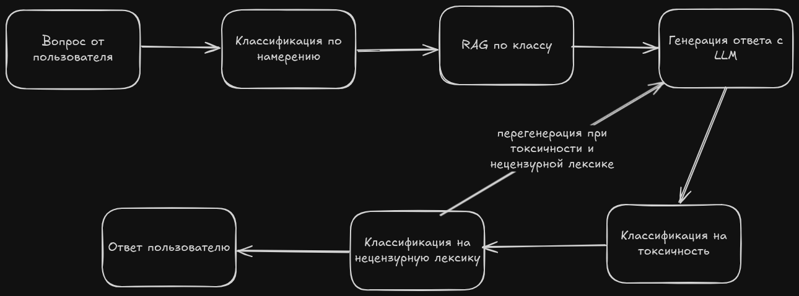
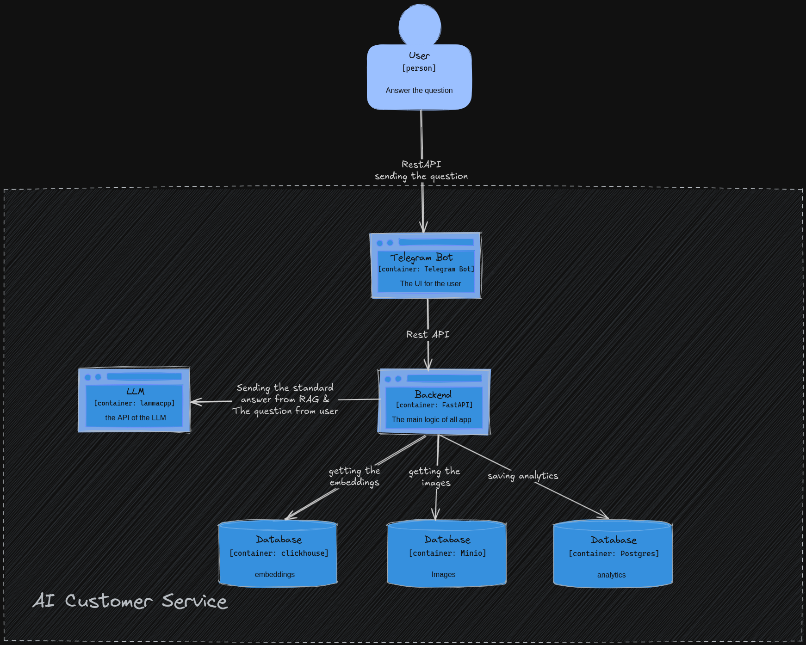

### Описание
Мы создаем универсального AI-помощника, который автоматически отвечает на 90% пользовательских вопросов, значительно снижая нагрузку на техподдержку и сокращая затраты компании. Решение использует технологии Retrieval-Augmented Generation (RAG) и поддерживает работу с текстом и изображениями, обеспечивая более точные и контекстуальные ответы. Наша уникальность — эффективное сочетание базы знаний и AI для мультимодальной обработки запросов.

### Пайплайн

### C4

### 1. Склонировать репозиторий

```bash
git clone https://github.com/RebelRaider/RuTubeOperatorAssistant
cd https://github.com/RebelRaider/RuTubeOperatorAssistant
```

### 2. Скопировать .docker/.env.example в .docker/.env и заполнить переменные

```bash
cp .docker/.env.example .docker/.env
nano .docker/.env
```

### 3. Скопировать configs/.env.example в configs/.env и заполнить переменные

```bash
cp configs/.env.example configs/.env
nano configs/.env
```

### 8. Скопировать tg-assistant/.env.example в tg-assistant/.env и заполнить переменные

```bash
cp tg-assistant/.env.example tg-assistant/.env
nano tg-assistant/.env
```

### 4. Запустить make load-models

```bash
make load-models
```

### 5. Скачать intent classifier или обучить самому

#### Скачать intent classifier:
1. Перейдите по ссылке: [intent classifier](https://drive.google.com/drive/folders/1ibnijlNpUkfsEhPov1SGSIFXPUwpKY4P?usp=sharing).
2. Скачайте и распакуйте файлы в нужную директорию.

#### Обучить самому:
```bash
python ./ml/intention/train.py
```

### 6. Запустить docker compose up --build

```bash
docker compose up --build
```

### 7. Запустить индексирование данных

```bash
python ./ml/rag/indexing.py
```

Убедитесь, что все необходимые переменные окружения и пути к данным установлены корректно перед запуском команд.

### notebooks
1. [llama](./ml/notebooks/pipeline.ipynb) - ноутбук с работой llama-ой через llama-cpp
2. [rag](./ml/notebooks/rag.ipynb) - ноутбук с работой rag-а через llama-cpp
3. [intention](./ml/notebooks/intention.ipynb) - ноутбук с работой intention через llama-cpp

### ml pipelines
1. [RAG](./ml/rag) - реализация утилитарных функций RAG
2. [Intention](./ml/intention) - пайплайн работы с классификацией намерений пользователя
3. [Classification](./ml/classificators) - пайплайн работы с классификацией нецензурной и токсичной лексики
4. [Embedders](./ml/embeddings) - пайплайн работы с эмбедингами
5. [LLM](./ml/llm) - реализация пайплайнов для работы с LLM
6. [models](./ml/models) - все мл модели